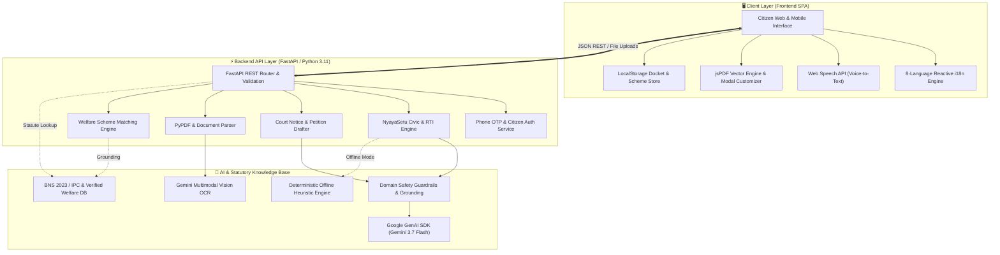

# ⚖️ NyayMitra AI (न्यायमित्र AI)

### 🇮🇳 India's First Multilingual AI Civic-Rights Navigator, Statutory RTI Action Engine & Legal Justice Platform

[](https://python.org)
[](https://fastapi.tiangolo.com)
[](https://ai.google.dev/)
[](https://github.com/shivam-1919/Nyaymitra)
[](https://github.com/shivam-1919/Nyaymitra)
[](https://render.com)
[]()
[](LICENSE)
[]()

---

> **🏆 Hackathon Submission Statement:**  
> **NyayMitra AI** is a citizen-first civic-tech and legal empowerment platform that democratizes access to statutory rights and public accountability across India. It bridges the critical justice gap by enabling ordinary citizens—regardless of literacy level or language—to understand their rights, identify responsible public authorities, generate court-standard discoverable-records RTI applications, audit contracts for predatory clauses via camera OCR, check eligibility for 16+ welfare schemes with actionable application SOPs, serve 15-day demand notices, and track 30-day statutory deadlines with 1-click **Section 19(1) First Appeals** — 100% free of lawyer fees and fully available in **8 Indian languages**.

---

## 🌐 Live Demo & API Documentation

* 🚀 **Live Production Application:** [https://nyaymitra-ftpx.onrender.com/](https://nyaymitra-ftpx.onrender.com/)
* 🎥 **YouTube Demo Video:** [https://youtu.be/mS1XUAN9GZM](https://youtu.be/mS1XUAN9GZM)
* 📚 **Interactive Swagger API Docs:** [https://nyaymitra-ftpx.onrender.com/docs](https://nyaymitra-ftpx.onrender.com/docs)
* 📖 **ReDoc API Specifications:** [https://nyaymitra-ftpx.onrender.com/redoc](https://nyaymitra-ftpx.onrender.com/redoc)
* 📁 **GitHub Source Code:** [https://github.com/shivam-1919/Nyaymitra](https://github.com/shivam-1919/Nyaymitra)

---

## ⚡ 60-Second Judge Evaluation Walkthrough

Experience the complete end-to-end civic action workflow on the live deployment in under a minute:

1. **Open the Portal:** Navigate to **[https://nyaymitra-ftpx.onrender.com/](https://nyaymitra-ftpx.onrender.com/)**.
2. **Switch Language (Top-Right):** Choose between **English**, **हिन्दी (Hindi)**, **Hinglish**, **मराठी (Marathi)**, **বাংলা (Bengali)**, **தமிழ் (Tamil)**, **తెలుగు (Telugu)**, or **ગુજરાતી (Gujarati)** — observe real-time, zero-reload full-page translation.
3. **Select or Voice-Input a Grievance:**
   * In **NyayaSetu (Step 1)**, click one of the interactive quick pills (e.g., *"Road Repair Delay"*, *"Ration Card Stuck"*, *"Street Vendor Licence Issue"*, *"Rent Deposit Withheld"* or *"Police FIR Refused"*), or speak via the **Microphone Voice Input**.
4. **Answer Guided Targeted Questionnaire (Step 2):**
   * Click **Continue to Guided Analysis**. All questions, hints, and category selectors are localized into your chosen language while strictly preserving typed answers.
5. **Inspect Public Authority & Statutory Confidence (Step 3):**
   * View the identified Nodal Department, PIO Designation, First Appellate Authority, and transparent statutory confidence badge (**🟢 Confirmed from Official Source** / **🟡 Likely Jurisdiction**).
6. **Generate Ready-to-Print Action Pack (Step 4):**
   * Click **Generate Ready-to-Print Action Pack** to receive the records-based Section 6(1) RTI Application, Mandatory Evidence Checklist, and Statutory Escalation Roadmap.
7. **Personalize & Download Clean Vector PDF:**
   * Click **Download PDF** ➔ The **Pre-PDF Citizen Details Modal** enables reviewing applicant name, postal address, authority addressee, filing city, and docket number.
   * Export the sanitized, high-contrast vector PDF with official letterhead formatting.
8. **Track Case & Trigger Section 19(1) First Appeal (Step 5):**
   * Click **Track Case** to save to local docket storage. If 30 days elapse without a PIO response, generate a **1-Click Section 19(1) Statutory First Appeal** citing deemed refusal under Section 7(2).

---

## 🧭 Architecture & Workflows

### 1. 🚶 The Citizen Journey Architecture (5-Step Civic Action Flow)

```text
┌─────────────────────────────────────────────────────────────────────────────┐
│ 1. CITIZEN PROBLEM INPUT                                                    │
│    • Plain Text or Voice Input (Web Speech API) in 8 Indian Languages       │
│    • Scope: Municipal Works, Ration/PDS, Vendor Rights, Tenancy, Police, etc.│
└──────────────────────────────────────┬──────────────────────────────────────┘
                                       ↓
┌─────────────────────────────────────────────────────────────────────────────┐
│ 2. TARGETED DYNAMIC QUESTIONNAIRE                                           │
│    • Dynamic Fact-Gathering (Application Dates, Receipt / Ack No., Location)│
│    • Multilingual Localization + Reactive User Input Preservation           │
└──────────────────────────────────────┬──────────────────────────────────────┘
                                       ↓
┌─────────────────────────────────────────────────────────────────────────────┐
│ 3. STATUTORY JURISDICTION & AUTHORITY AUDIT                                 │
│    • Responsible Public Authority Resolution & Gazetted Mapping             │
│    • Transparent Confidence Badging (🟢 Confirmed  🟡 Likely  🔴 Verified)  │
└──────────────────────────────────────┬──────────────────────────────────────┘
                                       ↓
┌─────────────────────────────────────────────────────────────────────────────┐
│ 4. FORM-READY ACTION PACK & NOTICE GENERATOR                                │
│    • Section 6(1) Discoverable-Records RTI Application Draft                │
│    • Mandatory Evidence & Annexure Checklist                                │
│    • Pre-PDF Citizen Customizer Modal + Client-Side Vector jsPDF Engine    │
└──────────────────────────────────────┬──────────────────────────────────────┘
                                       ↓
┌─────────────────────────────────────────────────────────────────────────────┐
│ 5. DOCKET TRACKER & STATUTORY FIRST APPEAL                                  │
│    • Persistent LocalStorage Docket Management                              │
│    • 30-Day Response Clock + 1-Click Section 19(1) First Appeal Generator   │
└─────────────────────────────────────────────────────────────────────────────┘
```

---

### 2. 🏛️ Full-Stack Technical Architecture & Data Flow



---

## 🌟 Comprehensive Module Breakdown

| Module | Citizen Challenge | AI & Statutory Solution |
| :--- | :--- | :--- |
| **🧭 Civic Rights Navigator (NyayaSetu)** | *"My municipal road is broken / ration card pending / street vendor challaned unlawfully."* | Maps grievance to responsible nodal authority, calculates statutory 30-day escalation clocks, and drafts official discoverable-records RTI requests. |
| **📑 Conversational RTI Form-Filler (Form 'A')** | *"I need to file an official RTI but don't understand complex legal jargon."* | 6-step conversational interview auto-populating official statutory **Form 'A' (Section 6(1) RTI Act 2005)** with 1-click legal vector PDF export. |
| **🏛️ Welfare Scheme Finder & myScheme Matcher** | *"Which central/state subsidies, pensions, or healthcare cards do I qualify for?"* | Real-time multi-criteria profile matcher across **16+ verified welfare schemes** (PMAY, Ayushman Bharat & Vay Vandana, PM-SVANidhi, PM-Vishwakarma, PM-KMY, etc.) with step-by-step Online/Offline application SOPs. |
| **📝 Court-Standard Legal Notice & Petition Drafter** | *"I need to serve a legal notice to recover my money or draft an FIR complaint."* | Generates 15-Day Demand Notices (Sec 138 NI Act Cheque Bounce, Tenancy Eviction, Consumer Disputes, Police Complaints under Sec 173 BNSS) in stamped court paper format. |
| **📄 Document Clause Risk Auditor & Camera OCR** | *"Is this rental agreement or contract safe for me to sign?"* | Live mobile camera OCR & PDF uploader auditing contracts for one-sided penalties, rights-waiving traps, and oppressive terms with Gemini Vision. |
| **📚 BNS 2023 vs. IPC Crosswalk** | *"What is the new criminal law section for my FIR or police complaint?"* | Searchable comparative database mapping the 2024 criminal laws (Bharatiya Nyaya Sanhita, BNSS, BSA) to legacy IPC sections with bailable/cognizable classifications and community service provisions. |
| **🚨 Citizen Rights & Emergency SOS Directory** | *"I need immediate emergency legal aid or police protection."* | Speed-dial verified helplines (15100 NALSA Free Legal Aid, 1930 Cyber Crime, 1915 Consumer Helpline, 112 National Emergency, 1091 Women Safety) with D.K. Basu arrest guides and Traffic SOPs. |
| **💬 AI Legal Advisor (NyayaSetu Guide)** | *"I have a private legal query regarding rent, consumer fraud, or welfare."* | Scoped conversational assistant with domain-level guardrails strictly focusing on RTI, tenancy, consumer protection, and welfare schemes. |
| **📊 Citizen Docket Tracker & Sec 19(1) First Appeal** | *"The Public Information Officer did not reply within the mandatory 30 days."* | Local persistent docket tracker with remaining response days countdown and 1-click Section 19(1) First Appeal generation citing deemed refusal (Sec 7(2)). |
| **👤 Citizen Authentication & Profile Settings** | *"How do I manage my cases and auto-fill my contact details across notices?"* | Phone OTP verification or Guest Citizen mode with persistent localStorage profiles, saved dockets, and bookmarked schemes. |

---

## 🛠️ Complete Technology Stack

```text
┌──────────────────────────────────────────────────────────────────────────────────┐
│                                NYAYMITRA TECH STACK                              │
├───────────────────────┬──────────────────────────────────────────────────────────┤
│ Backend Framework     │ Python 3.11+, FastAPI 0.115+, Uvicorn (ASGI), Pydantic v2│
├───────────────────────┼──────────────────────────────────────────────────────────┤
│ AI & LLM Engine       │ Google GenAI SDK (google-genai v1.0+), Gemini 3.7 Flash  │
│                       │ Fallback: Gemini 3.5 Flash Lite / Deterministic Engine   │
├───────────────────────┼──────────────────────────────────────────────────────────┤
│ Document & Vision OCR │ Gemini Multimodal Vision API, PyPDF 4.2+                 │
├───────────────────────┼──────────────────────────────────────────────────────────┤
│ Frontend Architecture │ Vanilla JavaScript (ES6+ Modular Controllers), HTML5     │
│                       │ Modern CSS3 with Design Tokens, Tailwind CSS (CDN)       │
├───────────────────────┼──────────────────────────────────────────────────────────┤
│ Iconography & UI      │ Lucide Icons, Glassmorphic Modals, Responsive Drawers    │
├───────────────────────┼──────────────────────────────────────────────────────────┤
│ PDF Generation Engine │ jsPDF Vector Engine (Client-Side Vector Rendering)       │
│                       │ Pre-PDF Personal Details Customizer & ASCII Sanitization │
├───────────────────────┼──────────────────────────────────────────────────────────┤
│ Internationalization  │ Native Reactive i18n Engine (8 Indian Languages)         │
│                       │ 186+ UI Keys with Dynamic Field & State Preservation     │
├───────────────────────┼──────────────────────────────────────────────────────────┤
│ Speech Recognition    │ Web Speech API (Voice-to-Text Input)                     │
├───────────────────────┼──────────────────────────────────────────────────────────┤
│ Cloud & Deployment    │ Render Web Services (Production Linux Container)         │
├───────────────────────┼──────────────────────────────────────────────────────────┤
│ Testing & QA          │ Pytest, FastAPI TestClient, 4 Custom Automated Suites    │
└───────────────────────┴──────────────────────────────────────────────────────────┘
```

---

## 🌐 Full-Stack Multilingual Support (8 Indian Languages)

NyayMitra features deep reactive internationalization (`frontend/js/i18n.js`):

1. 🇬🇧 **English**
2. 🇮🇳 **हिन्दी (Hindi)**
3. 🗣️ **Hinglish**
4. 🚩 **मराठी (Marathi)**
5. 🌾 **বাংলা (Bengali)**
6. 🛕 **தமிழ் (Tamil)**
7. 🏛️ **తెలుగు (Telugu)**
8. 🌊 **ગુજરાતી (Gujarati)**

* **186+ UI Keys & Dynamic Questionnaire Fields:** 100% dictionary coverage across all pages, forms, placeholders, option dropdowns, and error alerts.
* **Reactive Input Retention:** Switching language preserves all user-entered form data without resetting inputs.
* **Clean Vector Output:** Non-ASCII characters are sanitized for universal printable compatibility.

---

## 📱 Mobile-First Accessibility & UX

NyayMitra is engineered to run smoothly on budget smartphones and low-bandwidth connections across India:

* **Pinned 5-Item Mobile Bottom Bar:** Fast one-thumb navigation (`Action`, `RTI Form`, `Advisor`, `Schemes`, `Tools`).
* **Responsive Bottom-Sheet Menu:** Smooth modal drawer for secondary tools on mobile screens.
* **Touch Momentum Scrolling:** Smooth, overflow-contained horizontal navigation tabs with navigation arrows.
* **Voice-to-Text Grievance Input:** Integrated Web Speech API for voice-driven grievance capture.
* **Day / Night Mode Toggle:** High-contrast themes for outdoor daylight or low-light conditions.

---

## 🔌 API Reference & Endpoints

NyayMitra exposes a comprehensive RESTful API documented automatically via OpenAPI / Swagger:

### 1. Civic Rights & RTI Engine (NyayaSetu)
* `POST /api/nyayasetu/analyze-problem` — Classifies citizen grievance, identifies public authority, and returns dynamic follow-up questions.
* `POST /api/nyayasetu/generate-action-pack` — Generates official Section 6(1) RTI draft, evidence checklist, and escalation roadmap.
* `POST /api/nyayasetu/generate-first-appeal` — Generates Section 19(1) Statutory First Appeal petition citing deemed refusal (Section 7(2)).
* `GET /api/nyayasetu/schemes/list` — Returns all 16+ verified government welfare schemes with full application steps.
* `POST /api/nyayasetu/schemes/check` — Multi-criteria eligibility matcher scoring schemes against citizen demographics.

### 2. Legal Consultation, Drafting & Analysis
* `POST /api/chat` — Conversational AI legal consultation with domain guardrails and language selection.
* `GET /api/templates` — Lists court-standard drafting templates (Cheque bounce, RTI, Consumer notice, Tenancy, FIR).
* `POST /api/draft` — Compiles and renders complete legal notice or petition draft.
* `POST /api/analyze/text` — Analyzes raw legal text and returns plain-language summary, risk classifications, and counter-clauses.
* `POST /api/analyze/upload` — Multimodal document analyzer for PDFs and camera images (OCR).

### 3. Statutory Knowledge & Citizen Safety
* `GET /api/statutes` — Searchable BNS 2023 vs. IPC 1860 database with category filtering.
* `GET /api/rights` — Returns constitutional citizen rights guides and verified 24x7 emergency helplines.

### 4. Auth & Configuration
* `POST /api/auth/send-otp` — Sends authentication OTP to citizen phone or email.
* `POST /api/auth/verify-otp` — Verifies OTP and returns authenticated citizen profile.
* `GET /api/health` — System health status, API key verification, indexed statutes count, and active model.
* `POST /api/config` — Updates Gemini API key and active model at runtime.
* `POST /api/config/test` — Tests live connectivity to Gemini API.

---

## 🚀 Quick Start & Local Setup

### Prerequisites
* **Python 3.11+** installed on your system.
* **Git** installed.
* *(Optional)* A Google Gemini API Key from [Google AI Studio](https://aistudio.google.com/app/apikey). *(NyayMitra works fully offline with its heuristic fallback engine if no key is provided).*

---

### Step-by-Step Installation

#### 1. Clone the Repository
```bash
git clone https://github.com/shivam-1919/Nyaymitra.git
cd Nyaymitra
```

#### 2. Create & Activate Virtual Environment

**Windows (PowerShell):**
```powershell
python -m venv .venv
.\.venv\Scripts\Activate.ps1
```

**Windows (Command Prompt):**
```cmd
python -m venv .venv
.\.venv\Scripts\activate.bat
```

**Linux / macOS:**
```bash
python3 -m venv .venv
source .venv/bin/activate
```

#### 3. Install Dependencies
```bash
pip install -r requirements.txt
```

#### 4. Configure Environment Variables
Copy `.env.example` to `.env` (or configure via the in-app settings UI):
```bash
cp .env.example .env
```
Edit `.env`:
```env
GEMINI_API_KEY=your_gemini_api_key_here
GEMINI_MODEL=gemini-3.7-flash
HOST=127.0.0.1
PORT=8000
```

#### 5. Launch the Application
Run the root runner:
```bash
python run.py
```
Or start Uvicorn directly with hot-reloading:
```bash
uvicorn backend.app:app --reload --host 127.0.0.1 --port 8000
```
Open **[http://127.0.0.1:8000](http://127.0.0.1:8000)** in your browser.

---

## 🧪 Comprehensive Automated Test Suites

The repository contains 4 automated verification suites validating all layers of the application:

```bash
# 1. Full System & Endpoint Integration Suite
python test_suite.py

# 2. 100% Full Page HTML i18n Translation Coverage Check (186+ keys)
python test_full_page_i18n.py

# 3. Dynamic Questionnaire Localization & Hindi Translation Check
python test_questionnaire_i18n.py

# 4. Vector PDF Customizer Modal & ASCII Font Sanitization Check
python test_customizer_and_i18n.py
```

**Test Status:** **100% PASS** across all modules and verification benchmarks.

---

## 📂 Repository Directory Structure

```text
Nyaymitra/
├── backend/
│   ├── data/
│   │   └── verified_welfare_schemes.json  # 16+ Curated & Grounded Scheme Profiles
│   ├── app.py                             # FastAPI Application & API Endpoints
│   ├── config.py                          # Application Settings & Dynamic Key Loader
│   ├── document_parser.py                 # PyPDF & Multimodal File Ingestion
│   ├── gemini_service.py                  # Gemini 3.7 Flash SDK, Vision OCR & Prompts
│   ├── legal_knowledge.py                 # BNS/IPC Crosswalk, Helplines & Notice Templates
│   ├── nyayasetu_engine.py                # Public Authorities DB & Action Pack Engine
│   └── test_app.py                        # Backend Unit Tests
├── frontend/
│   ├── css/
│   │   └── styles.css                     # Custom Design Tokens & Mobile Styles
│   ├── js/
│   │   ├── analyzer.js                    # Document Clause Risk Auditor Controller
│   │   ├── api.js                         # API Client & jsPDF Vector Exporter
│   │   ├── app.js                         # Main Application & Navigation Controller
│   │   ├── chat.js                        # Scoped AI Legal Advisor Controller
│   │   ├── drafter.js                     # Legal Notice & Petition Drafter Controller
│   │   ├── formfiller.js                  # Conversational RTI Form 'A' Controller
│   │   ├── i18n.js                        # 8-Language Reactive Translation Engine
│   │   ├── nyayasetu.js                   # 5-Step Civic Action Navigator Controller
│   │   ├── rights.js                      # Citizen Rights & Emergency SOS Controller
│   │   ├── schemes.js                     # Welfare Scheme Finder & Matcher Controller
│   │   └── statutes.js                    # BNS vs. IPC Database Crosswalk Controller
│   ├── screens/                           # Responsive Layout Specs & Blueprints
│   └── index.html                         # Responsive Single-Page Application (SPA)
├── .env.example                           # Sample Environment Configuration
├── render.yaml                            # Zero-Downtime Render Deployment Spec
├── requirements.txt                       # Production Python Dependencies
├── run.py                                 # Local Server Runner Script
├── test_suite.py                          # Full System Integration Test Suite
├── test_full_page_i18n.py                 # Full Page i18n Dictionary Coverage Test
├── test_questionnaire_i18n.py             # Dynamic Questionnaire Localization Test
├── test_customizer_and_i18n.py            # PDF Customizer & Sanitization Test
└── README.md                              # Complete Project Documentation
```

---

## 🛡️ Privacy, Safety & Ethical AI Design

1. **Zero Server PII Retention:** No personal identification data, telephone numbers, or private case narratives are permanently recorded in server databases; document rendering occurs client-side.
2. **Server-Side Credential Isolation:** Gemini API keys are loaded strictly through secure environment variables and never exposed to client-side scripts.
3. **Anti-Hallucination Legal Grounding:** Welfare scheme benefits, eligibility criteria, and emergency numbers are grounded against versioned static datasets (`backend/data/verified_welfare_schemes.json`).
4. **Strict Domain-Scope Enforcement:** The AI Advisor is guardrailed exclusively to RTI, tenancy disputes, consumer protection, and welfare schemes. Out-of-scope legal inquiries are redirected to **NALSA (15100)**.
5. **Universal Offline Heuristic Fallback:** If API quotas are exceeded or internet connectivity is intermittent, the platform automatically switches to its heuristic rule engine with zero downtime.

---

## 👥 Contributors & Hackathon Team

* **Lead Developer:** Shivam ([@shivam-1919](https://github.com/shivam-1919))
* **Supporting Developers & Team Members:**
  * Subham Kumar ([@Subham-Seth](https://github.com/Subham-Seth/))
  * Saurabh Kumar Sahni ([@rajendersahni87-bit](https://github.com/rajendersahni87-bit))

---

## 📄 License

This project is licensed under the **MIT License** — see the [LICENSE](LICENSE) file for details.
